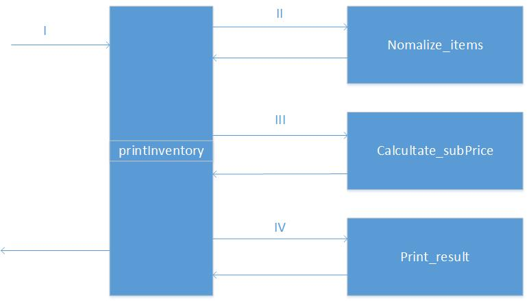

# pos-v1-node题目划分



```
#1 printInventory
输入：
	inputItems:[String]
	normal_items:[{id,number,name,unit,price,totalPrice}]
	promotion:{[{name,number}],subprice,total_price}
输出：
	normal_items:[{id,number,name,unit,price,totalPrice}]
	promotion:{[{name,number,unit}],subprice}
	str_inventory:String
#2 Normalize_items
输入：
	inputItems:[String]
输出：
	normal_items:[{id,number,name,unit,price,totalPrice}]
#3 Calcultate_subPrice
输入
	normal_items:[{id,number,name,unit,price,totalPrice}]
输出：
	promotion:{[{name,number,unit}],subprice}
#5 Print_result
输入：
	normal_items:[{id,number,name,unit,price,totalPrice}]
	promotion:{[{name,number,unit}],subprice}
输出：
	str_inventory:String

```
